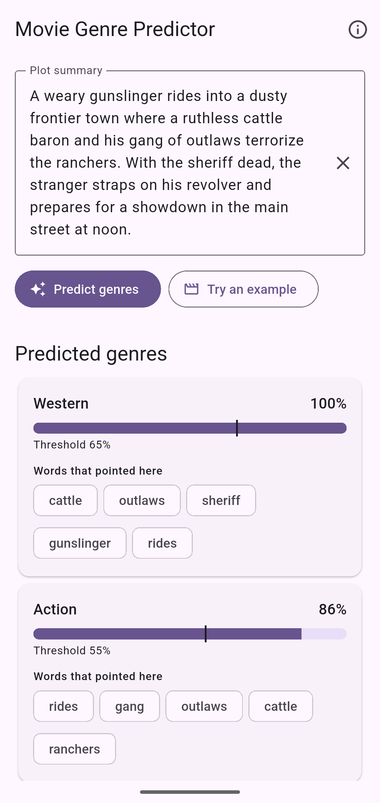
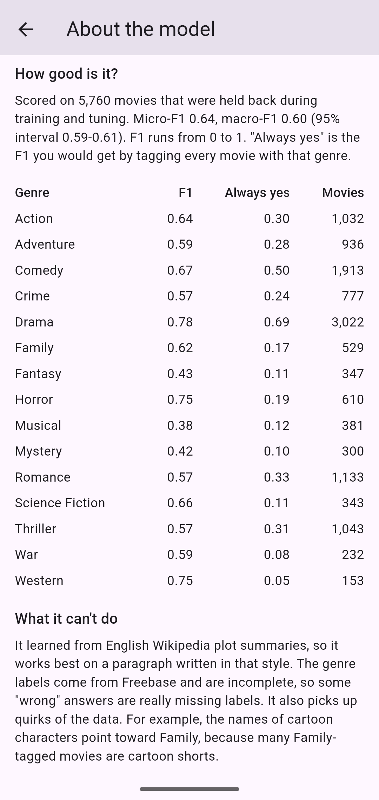

# Movie Genre Predictor

Paste a movie plot and get its genres, on your phone, with no internet connection.

The model is a TF-IDF + logistic regression classifier (one per genre) built in Python from 38,397 Wikipedia plot summaries: 26,877 for training, and the rest for validation and a held-out test. Its weights are exported to a JSON file, and a Flutter app bundles that file and makes predictions in plain Dart. There is no server and no ML runtime, and the Android release build doesn't even request network permission. For each predicted genre, the app also shows the words in your text that pushed hardest toward it.

<p align="center">
  
  &nbsp;
  
</p>
<p align="center"><sub>The release build on an Android emulator, in airplane mode.</sub></p>

The full write-up is [docs/Report.pdf](docs/Report.pdf) (also as an editable [Word file](docs/Report.docx)), and the slides are [docs/Presentation.pptx](docs/Presentation.pptx).

## How it works

```
 training/  (Python, scikit-learn)                          app/  (Flutter, Dart)
 ─────────────────────────────────                          ─────────────────────
 CMU Movie Summary Corpus                                   your plot text
   │  map 363 Freebase labels → 15 genres                     │
   ▼                                                          ▼
 tokenize ─► TF-IDF (20k words) ─► 15 logistic regressions   tokenize   (same rules)
   │                                  │                       ▼
   │        thresholds tuned on validation data              TF-IDF    (same vocabulary + IDF)
   ▼                                  ▼                       ▼
 model.json  = vocabulary + IDF + weights + thresholds ────► 15 × sigmoid(w·x + b) ≥ threshold?
                                                              ▼
                                                           genres + top words
```

- **Tokenizer:** a token is a run of 2+ ASCII letters, lowercased. It's simple on purpose, so Python and Dart split text exactly the same way ([why](training/tokenizer.py)).
- **Multi-label:** a movie can be several genres at once, so each genre gets its own yes/no model and its own decision threshold.
- **Explanations:** the model is linear, so a genre's score (in log-odds) is the intercept plus one `weight × tf-idf` term per word. The "top words" are the largest of those terms. That's an exact breakdown of the score, not an approximation. Because of the TF-IDF scaling, though, a word's term also depends on the rest of the text ([details](STUDY.md#10-prediction-in-dart)).

## Results

Scored once on a held-out test set of 5,760 movies that played no part in training, feature selection, choosing C or tuning thresholds.

| Genre | Test movies | Threshold | Precision | Recall | F1 | F1 at 0.5 | F1 always-yes |
|---|--:|--:|--:|--:|--:|--:|--:|
| Action | 1,032 | 0.55 | 0.577 | 0.721 | **0.641** | 0.634 | 0.304 |
| Adventure | 936 | 0.56 | 0.530 | 0.660 | **0.588** | 0.587 | 0.280 |
| Comedy | 1,913 | 0.48 | 0.604 | 0.741 | **0.666** | 0.665 | 0.499 |
| Crime | 777 | 0.57 | 0.515 | 0.644 | **0.572** | 0.578 | 0.238 |
| Drama | 3,022 | 0.39 | 0.700 | 0.870 | **0.776** | 0.755 | 0.688 |
| Family | 529 | 0.65 | 0.632 | 0.603 | **0.617** | 0.570 | 0.168 |
| Fantasy | 347 | 0.66 | 0.434 | 0.427 | **0.430** | 0.457 | 0.114 |
| Horror | 610 | 0.62 | 0.741 | 0.754 | **0.747** | 0.734 | 0.192 |
| Musical | 381 | 0.66 | 0.367 | 0.388 | **0.378** | 0.380 | 0.124 |
| Mystery | 300 | 0.69 | 0.403 | 0.443 | **0.422** | 0.395 | 0.099 |
| Romance | 1,133 | 0.47 | 0.468 | 0.721 | **0.568** | 0.572 | 0.329 |
| Science Fiction | 343 | 0.58 | 0.594 | 0.735 | **0.657** | 0.642 | 0.112 |
| Thriller | 1,043 | 0.50 | 0.497 | 0.677 | **0.573** | 0.573 | 0.307 |
| War | 232 | 0.72 | 0.546 | 0.638 | **0.588** | 0.590 | 0.077 |
| Western | 153 | 0.65 | 0.775 | 0.719 | **0.746** | 0.682 | 0.052 |
| *micro average* | | | 0.582 | 0.718 | **0.643** | 0.624 | 0.257 |
| *macro average* | | | 0.559 | 0.649 | **0.598** | 0.588 | 0.239 |

- **Confidence intervals:** the 95% bootstrap intervals are micro-F1 0.636 to 0.649 and macro-F1 0.588 to 0.608.
- **F1 always-yes** tags every movie with the genre. That's the floor any real model has to beat. It's high for Drama only because half of all movies are dramas.
- **F1 at 0.5** is the same model without tuned thresholds. Tuning adds about +0.01 macro-F1 overall.
  - It helped 9 genres, most of all Western (+0.064) and Family (+0.047).
  - It tied for Thriller.
  - It did slightly *worse* than 0.5 for 5 genres: Fantasy (−0.026), and Crime, Romance, Musical and War (by 0.006 or less).
  - A threshold picked on 5,760 validation movies is itself a noisy estimate.
- **Per movie:** only 17% of movies get their exact genre set right, which is normal for multi-label problems with 15 labels. The per-movie F1 is 0.631.
- **Two biases pull in opposite directions:**
  - The Freebase labels are incomplete, so some correct predictions count as errors.
  - Film series (Looney Tunes, the Three Stooges) appear in both train and test, so Family and Comedy look a little better than they would on genuinely new films ([details](STUDY.md#8-evaluation)).

Full numbers are in [training/results/](training/results/). The settings were compared on validation data only, with [training/experiments.py](training/experiments.py), whose output is saved in `results/experiments.txt`. A bigger vocabulary (+0.002 macro-F1) and word pairs (no gain) weren't worth the larger model file.

## Python and Dart give the same answers

The model is trained in one language and runs in another, so the project checks at three levels that they agree:

1. **Tokenizer:** [shared/tokenizer_cases.json](shared/tokenizer_cases.json) (accents, emoji, the Kelvin sign, `İ`, digits, …) is tested by both `pytest` and `flutter test`.
2. **Export:** `train.py` writes the new model to a staging file. It runs all 5,760 test plots through [reference.py](training/reference.py), a plain-Python re-implementation of the app's math, and compares the results with scikit-learn's. The largest probability difference is 4.1e-08, and 0 of 86,400 yes/no decisions differ. Only if the check passes does it replace `app/assets/model.json`.
3. **App:** [parity_test.dart](app/test/parity_test.dart) runs 48 cases through the Dart code: 42 test-set plots, chosen so every genre is predicted at least once, plus 6 edge cases. Tokens, every probability (within 1e-6 of scikit-learn), every yes/no decision and every top word must match.

## Project layout

```
training/               Python: data, training, evaluation, export
  download_data.py        fetch the corpus into training/data/ (not committed)
  genres.py               Freebase label → genre map
  tokenizer.py            the shared tokenizer
  data.py                 load, de-duplicate, split
  model.py                TF-IDF settings, per-genre logistic regression, threshold tuning
  evaluate.py             metrics and bootstrap intervals
  reference.py            the app's math in plain Python
  export.py               model.json and the parity fixture
  train.py                runs everything
  experiments.py          validation-only comparisons behind the settings
  top_words.py            each genre's strongest words, and where odd ones come from
  results/                metrics.json, results.md, experiments.txt
  tests/                  pytest
shared/
  tokenizer_cases.json    tokenizer cases used by both languages
app/                    Flutter (Android + iOS)
  assets/model.json       the exported model (3.5 MB)
  lib/main.dart           loads the model, shows the home page
  lib/src/tokenizer.dart  the shared tokenizer, in Dart
  lib/src/genre_model.dart  prediction + explanations
  lib/src/home_page.dart, about_page.dart, example_plots.dart
  test/                   tokenizer, parity and widget tests
docs/                   screenshots, the report (PDF and Word) and the slides
STUDY.md                a guided walkthrough of the code
```

## Run it yourself

Python 3.12:

```sh
py -3.12 -m venv .venv                  # macOS/Linux: python3.12 -m venv .venv
.venv\Scripts\activate                   # macOS/Linux: source .venv/bin/activate
pip install -r training/requirements.txt
python training/download_data.py         # ~46 MB download
python training/train.py                 # ~1.5 min; rewrites app/assets/model.json, the fixture and results/
pytest training
python training/experiments.py           # optional, ~4 min: the settings comparison
python training/top_words.py             # optional: what each genre's model learned
```

Flutter 3.44.2 or newer (Dart 3.12.2+, as `app/pubspec.yaml` requires):

```sh
cd app
flutter test
flutter run                              # phone or emulator
```

## Credits and licence

**Data.** CMU Movie Summary Corpus: David Bamman, Brendan O'Connor and Noah A. Smith, "Learning Latent Personas of Film Characters", *Proceedings of ACL 2013*. <https://www.cs.cmu.edu/~ark/personas/>. The plot summaries come from English Wikipedia and the genre labels from Freebase. The corpus is released under the [Creative Commons Attribution-ShareAlike 3.0 US licence](https://creativecommons.org/licenses/by-sa/3.0/us/legalcode).

**Files derived from the data.** `app/assets/model.json` was learned from the corpus, and `app/test/fixtures/parity_cases.json` contains plot summaries from it. Both are shared under the same CC BY-SA 3.0 US licence.

**Code.** © 2026 Zariff. Written from scratch for this project. It shares no code with earlier versions of the capstone.
